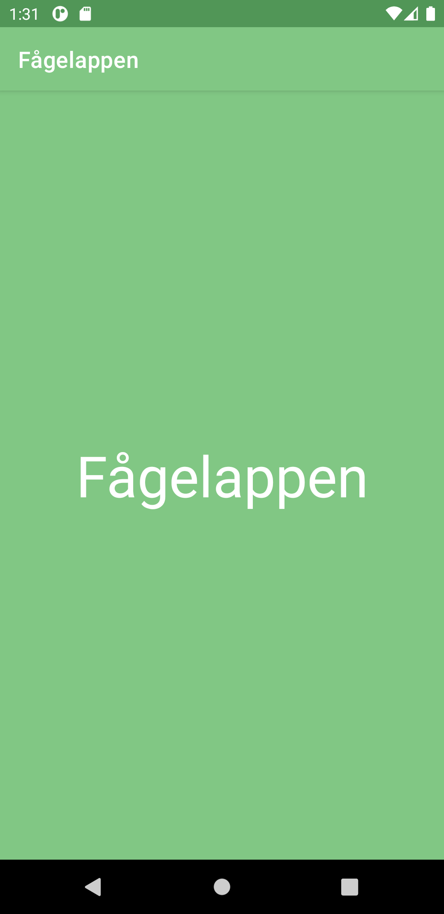
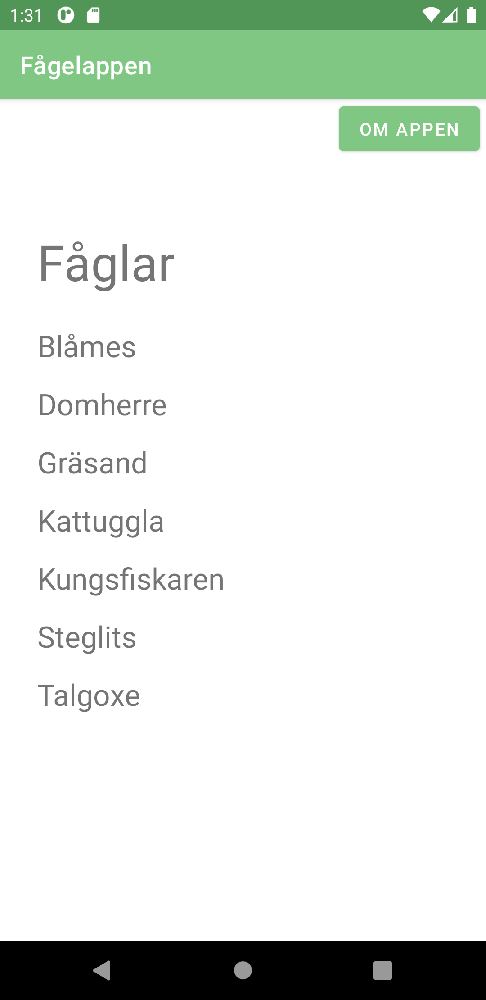
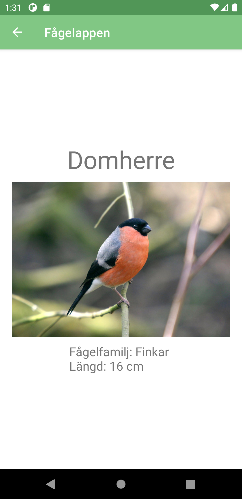

# Rapport

## Om fågelappen 
Fågelappen behandlar de fågelarter som någorlunda regelbundet häckar i Sverige eller under sin flyttning passerar landet.
Fågelappen är till för alla fågelintresserade som snabbt och smidigt vill komma åt information om fåglar, vilken finns lättillänglig i form en lista.
Denna information finns även på About sidan i appen för att visa målgrupp och vad det är för typ av app. På about sidan finns dessutom Attribution för alla bilder som används i appen. 

## Process
Ett nytt projekt skapades och lades till på Github.
Två aktiviteter skapades, en för "about page" och en för en sida som senare ska visa information om en fågelart. 


```xml
  <uses-permission android:name="android.permission.INTERNET" />
```
Gav appen internet åtkomst för att komma åt data från webservicen.
\


```java
    private ArrayList<Bird> listData;
    private ArrayAdapter<Bird> adapter;
```
Deklarerade två privata medlemsvariabler i MainActivity, en för arraylist och en för arrayadapter.\


En layout fil för list item skapades, där en textview lades till.\ 


```java
  listData = new ArrayList<>();
  adapter = new ArrayAdapter<>(this, R.layout.list_item, listData);
```
Dessa instansieras i oncreate, där arraylist tilldelas ett nytt arraylist objekt och adapter ett adapter objekt (med list_item och listData som parametrar).\  


```java
    ListView my_listView=(ListView) findViewById(R.id.list_view);
    my_listView.setAdapter(adapter);
```
En listview deklarerades och initierades med ett befintligt listview objekt med findviewByid. 
Adaptern applicerades därefter på my_listView med setAdapter();\  


```java
    public class Bird {
    
        private String ID;
        private String name;
        private String type;
        ... 
```
En klass för Bird skapades samt en för Auxdata. För dessa lades privata medlems variabler till för 
att kunna hantera data från webservicen.\ 


```java
 public String getName() {
        return name;
    }

    public String getCategory() {
        return category;
    }

    public int getSize() {
        return size;
    }
```
Skapade getter metoder i Bird klassen och Auxdata klassen för att kunna hämta data till MainActivity.\  


```java
@Override
    public String toString() {
        return name;
    }
}
```
Skapade en toString metod för att visa hur objektet ser ut som en sträng, där namn returneras som en sträng.\


Fyllde webservice med data om fåglar genom att använda "admin interface" verktyget.\


```java
new JsonTask().execute("https://wwwlab.iit.his.se/brom/kurser/mobilprog/dbservice/admin/getdataasjson.php?type=c20juler");
```
Json data från webservicen hämtas med "new JsonTask().execute()" och hanteras med JsonTask koden som hämtades från Github.\  
     
     
```java
protected void onPostExecute(String json) {
            Gson gson = new Gson();
            Bird[] temporary = gson.fromJson(json,Bird[].class);

            for (int i = 0; i < temporary.length; i++) {
                Bird bird = temporary[i];
                Log.d("AsyncTask ==>", "Found a bird!: "+bird);
                listData.add(bird);

            }
            adapter.notifyDataSetChanged();


        }
```     
Lade till gson biblioteket. I koden ovan deklarerades en variabel gson av typen Gson och instancierades med ett nytt Gson objekt. 
Därefter deklarerades en variabel "temporay" av typen Bird[], och instancierades med ett gson objekt som parsar json datan tillsammans med klassen Bird. 
Den temporära arrayen "temporary" loopas igenom med en for loop, och för varje instans läggs varje objekt till i bird och sendan i listData med add(). 
Därefter meddelas adaptern om att innehållet i "listData" har uppdaterats med notifyDataSetChanged().\ 


```java
my_listView.setOnItemClickListener(new AdapterView.OnItemClickListener() {
            @Override
            public void onItemClick(AdapterView<?> parent, View view, int position, long id) {

                String currentBirdName = listData.get(position).getName();
                String currentBirdCategory = listData.get(position).getCategory();
                int currentBirdSize = listData.get(position).getSize();
                String currentBirdImg = listData.get(position).getAuxdata().getImg();

                Intent birdIntent = new Intent(MainActivity.this, SecondActivity.class);
                birdIntent.putExtra("birdName", currentBirdName);
                birdIntent.putExtra("birdCategory", currentBirdCategory);
                birdIntent.putExtra("birdSize", currentBirdSize);
                birdIntent.putExtra("birdImg", currentBirdImg);

                startActivity(birdIntent);
            }
        });
```
En onClick listener sattes för items i listview. När man klickar på ett item körs getter metoderna i Bird klassen och det värde som returneras tilldelas till variabler av motsvarande datatyp.
Ett nytt intent skapas för att köra SecondActivity, där egenskaper hos den fågel man klickat på ska visas upp i en ny vy. 
Med intentet "birdIntent" skickas data med hjälp av .putExtra(). Där anges ett keyvalue par, där en nyckel skapas t.ex. "birdName" och "currentBirdName" som värde. Detta görs för varje fågel egenskap som ska skickas 
med till secondActivity. När all data lags till för intentet körs birdIntent med startActivity().\  


```java
    private String currentBirdName;
    private String currentBirdCategory;
    private String currentBirdSize;
    private String currentBirdImg;
```
I secondActivity skapas privata medlemsvariabler för att lagra parametrarna som skickades med birdIntent.\  


```java
        currentBirdName = getIntent().getExtras().get("birdName").toString();
        currentBirdCategory = getIntent().getExtras().get("birdCategory").toString();
        currentBirdSize = getIntent().getExtras().get("birdSize").toString();
        currentBirdImg = getIntent().getExtras().get("birdImg").toString();
```
Parametrarna som skickades med birdIntent hämtas med getIntent().getExtras().get("...").toString() och tilldelas till respektive privata medlemsvariabel som skapades enligt förra kodsnutten.\ 


```java
        TextView bird_name = (TextView) findViewById(R.id.bird_name);
        bird_name.setText(currentBirdName);

        TextView bird_information = (TextView) findViewById(R.id.bird_information);
        bird_information.setText("Fågelfamilj: "+currentBirdCategory+"\nLängd: "+currentBirdSize+" cm");

        ImageView imageView = findViewById(R.id.bird_img);
        Picasso.get().load(currentBirdImg).into(imageView);
```
De privata medlems variablerna läggs nu till för de olika vyerna. För textview användes setText(privat medlemsvariabel) och i imageview med hjälp av Picasso bibliotektet med load(privat medelmsvariabel) 
som laddar in bild url och visar den i imageview med into(imageView).\ 


```java
private static int splashTimer = 1200;

    @RequiresApi(api = Build.VERSION_CODES.P)
    @Override
    protected void onCreate(Bundle savedInstanceState) {
        super.onCreate(savedInstanceState);
        setContentView(R.layout.activity_welcome_splash);

        new Handler().postDelayed(()-> {
            finish();
        },splashTimer);
    }
```
Skapade en aktivitet för en splash screen som visas när man öppnar appen, den körs i början av Oncreate i MainActivity med ett intent. 
En timer för hur länge splash screenen visas sattes med en privat medlemsvariabel. I oncreate skapades en ny Handler() och postDelayed() som först kör splashTimer (fördröjer finish()) och därefter körs
finish() som avslutar aktiviteten. Splash screenen visar helt enkelt bara upp appens namn när applikationen startas.\  


```java
getSupportActionBar().setDisplayHomeAsUpEnabled(true);
```
```XML
<activity android:name=".MainActivity" android:launchMode="singleTop">
```
För att gå tillbaka till MainActivity från SecondActivity och AboutActivity används en tillbaka knapp i "app baren", denna applicerades med hjälp av java koden ovan tillsammans med 
launchMode="singleTop" för Mainactivity i Android Manifestet. Launchmode="singleTop" användes i detta fall som en lösning för att splashscreen inte ska köras varje gång man går tillbaka i applikationen.\ 


## Screenshots på färdig applikation\


**Splashscreen vid start av applikation**\ 


**Lista med fåglar**\


**Detalj vy för fågel efter att ha klickat på en fågel i listan**